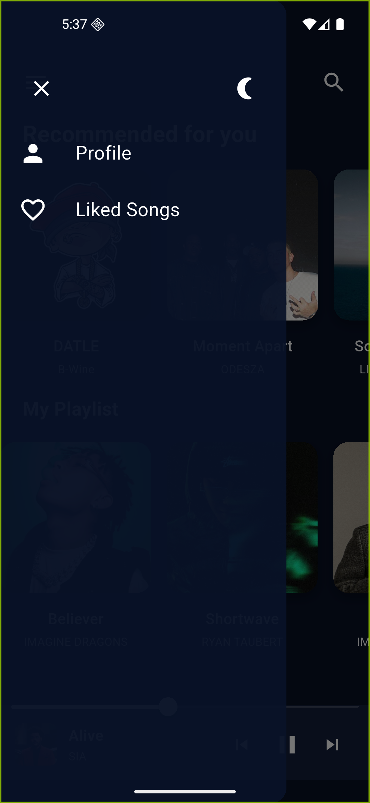
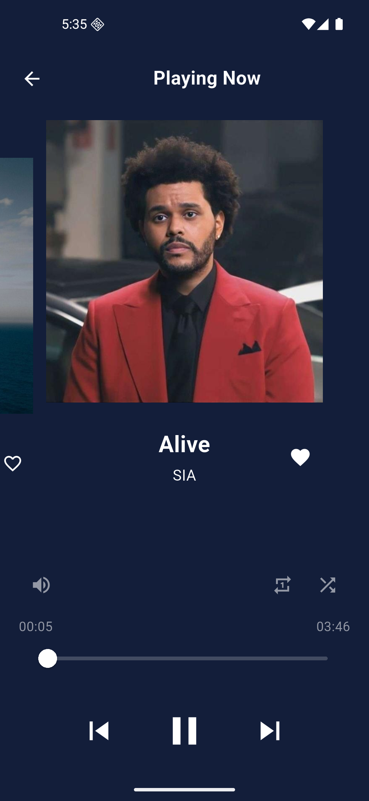
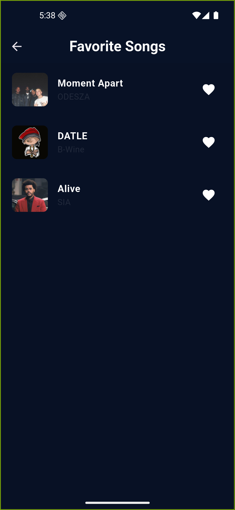

Music Application 

Ứng dụng nghe nhạc được xây dựng bằng Flutter
Thời Gian Thực Hiện: 23/3 (14:00 --> 18:00)

Tính Năng 
- Nghe nhạc
- play/pause
- chế độ darkmode/ lightmode

Công nghệ
- Flutter
- Dart
- Audio Player
- Bloc

Demo (Hình ảnh của App)

  
  
  
  

Ngày 30/3/2026 
Thời Gian Thực Hiện: 13:50 --> 17:50 
update thêm các tính Năng
+ next Song
+ previous Song
+ repeat Song 
+ add favorite Song 
+ Page List Favorite Songs

  
  
  

