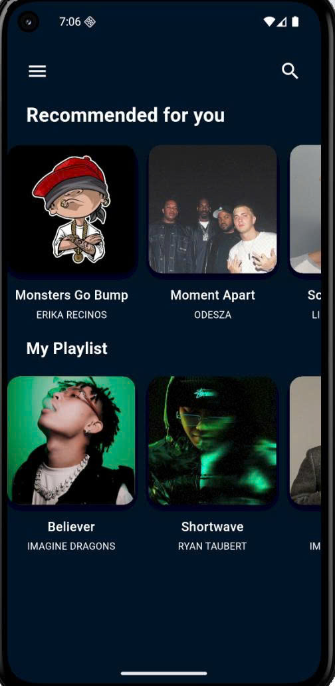
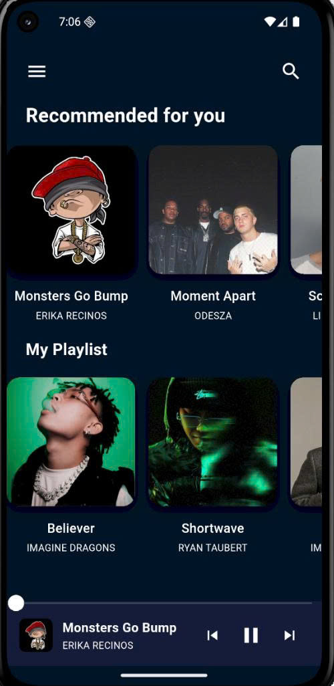
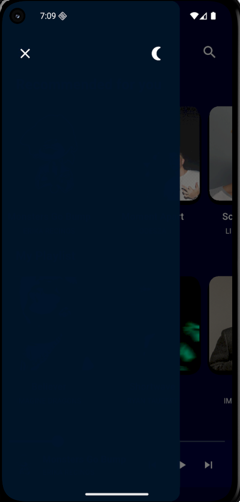
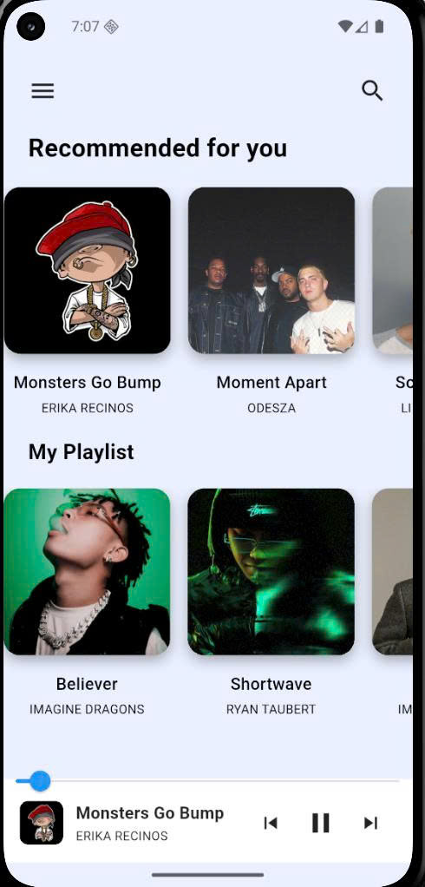

Music Application 

Ứng dụng nghe nhạc được xây dựng bằng Flutter
Thời Gian Thực Hiện: 23/3 (14:00 --> 18:00)

Tính Năng 
- Nghe nhạc
- play/pause
- chế độ darkmode/ lightmode

Công nghệ
- Flutter
- Dart
- Audio Player
- Bloc

Demo (Hình ảnh của App)

  
  
  
  

